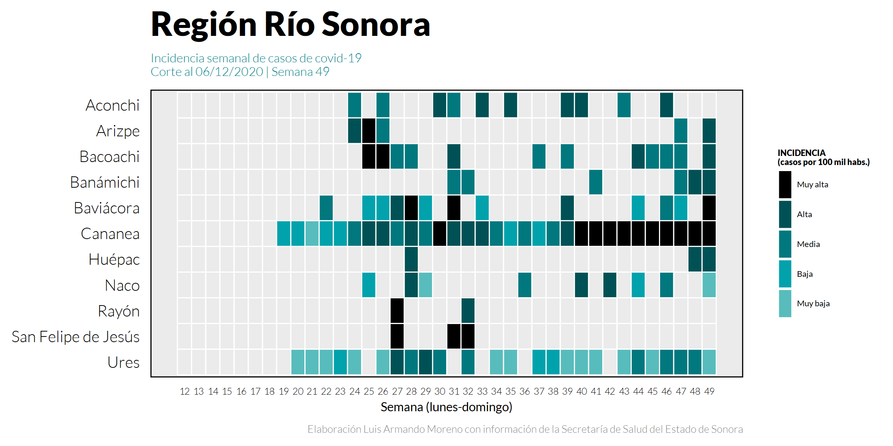
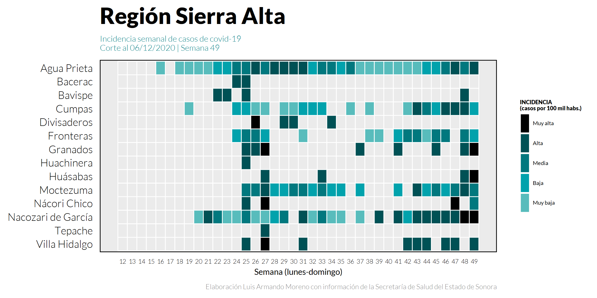
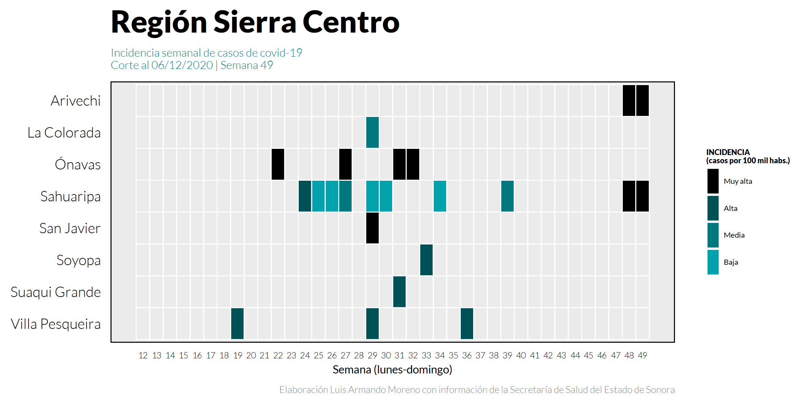
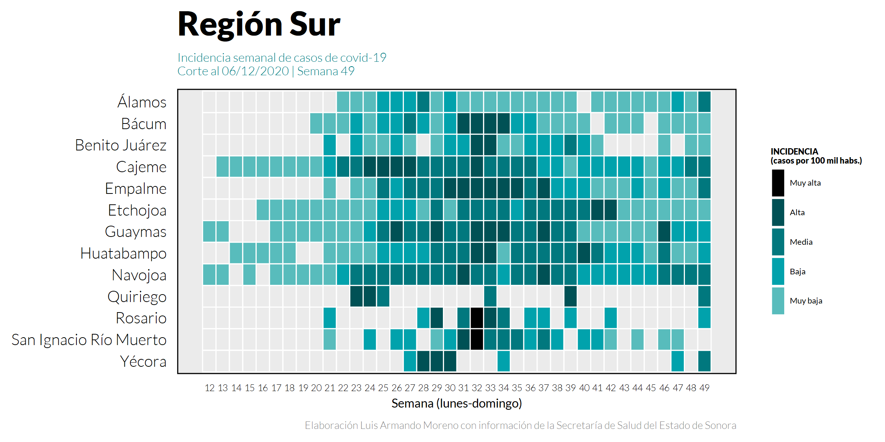
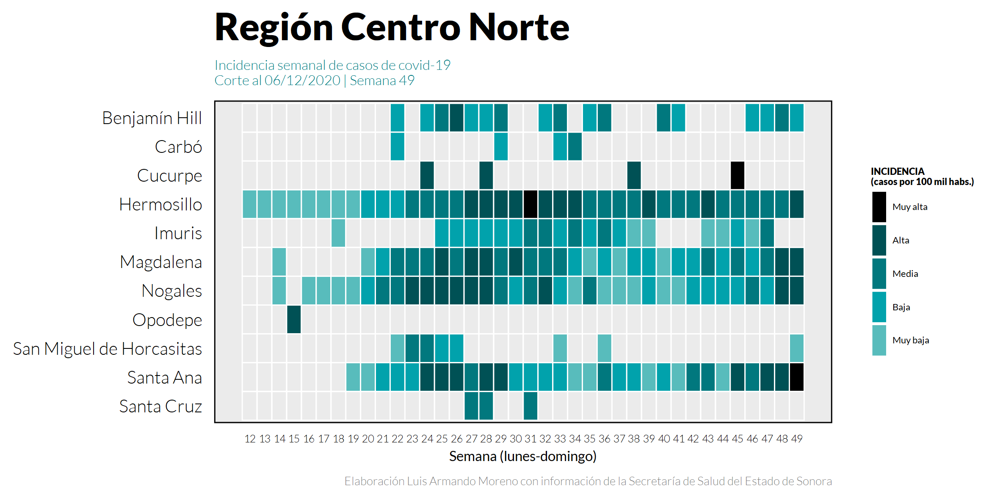
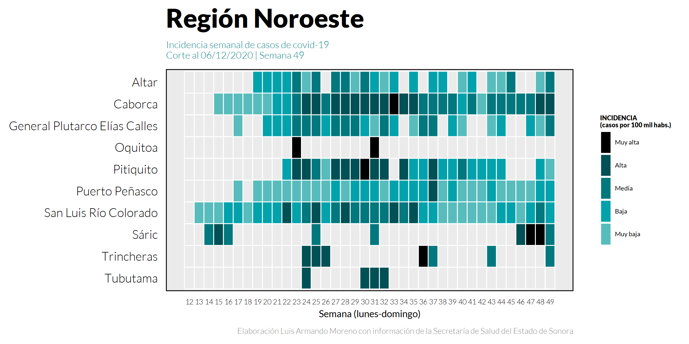
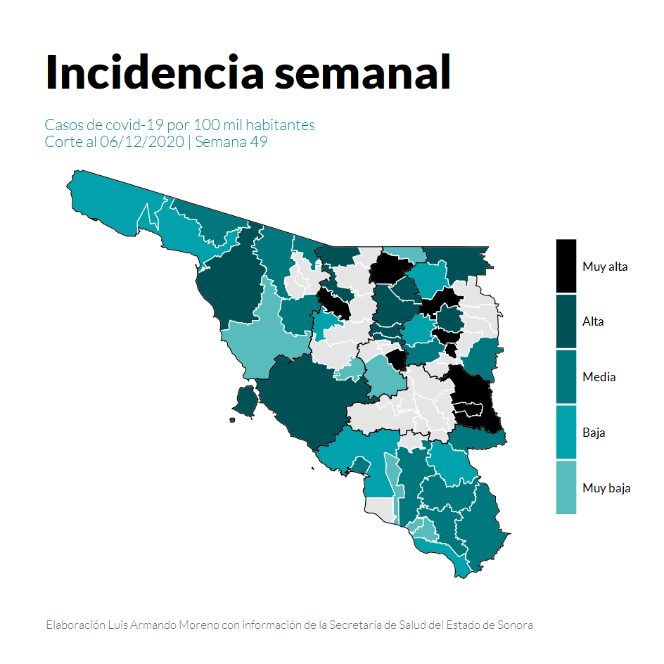

# Introducción

El virus SARS-Cov-2, desde su detección confirmada en Wuhan, China a fines del año pasado, ha trastocado la vida de todos y cada uno de los países del mundo, México no ha sido la excepción. El 16 de marzo de 2020, la Secretaría de Salud del Gobierno del Estado de Sonora confirmó el primer caso de Covid-19 (la enfermedad asociada al virus), con lo que dio comienzo la contingencia epidemiológica en la Entidad. 

Al día de hoy, 06 de diciembre de 2020 se han confirmado 44,301 casos, de los cuales se han recuperado 38,772 y lamentablemente han fallecido 3,473, con presencia del virus en 67 de los 72 municipios de la Entidad.

La epidemia y sus efectos en la población son un fenómeno cambiante tanto en el espacio temporal como el geográfico, por lo que es conveniente observar de manera detallada las tendencias en los municipios para tomar decisiones informadas que pudiesen afectar la vida diaria de los sonorenses.

El siguiente trabajo plasma la manera de elaborar mapas de calor de la incidencia semanal del covid-19 en las distintas regiones del estado de Sonora, utilizando el lenguaje de programación R.

# Paquetes

Paquetes necesarios para el manejo de los datos y su graficación

```{r, setup, warning=FALSE, message=FALSE}
library(tidyverse) # Paquete de paquetes, para manejo y visualización de datos.
library(lubridate) # Manipulación de datos que contienen fechas.
library(showtext) # Permite la carga de fuentes de Google Fonts para la visualización de datos.
library(Cairo) # Pquete que permite crear imágenes de gran calidad.
library(rgdal) # Para manejo de datos geoespaciales.
library(rgeos) # Para manejo de datos geoespaciales.
```

# Descarga de datos.

Descarga de proyección de población del Consejo Nacional de Población 2015-2030, la cual se puede consultar en el repositorio de datos abiertos del gobierno federal. El archivo contiene las proyecciones de los municipios de Oaxaca hasta Zacatecas, por sexo y cohorte de edad.

```{r, warning=FALSE, message=FALSE, error=FALSE}
# No es posible leer archivos .rar desde R por lo que se hace una llamada al programa 7z, el cual debe ser instalado previamente.

pob.url <- "http://www.conapo.gob.mx/work/models/CONAPO/Datos_Abiertos/Proyecciones2018/base_municipios_final_datos_02.rar"
pob.archivo <- "./Descargas/pob.rar"
pob.final <- "Bases/base_municipios_final_datos_02.csv"

if(!file.exists(pob.final)){
  download.file(pob.url, destfile = pob.archivo, quiet = TRUE, mode = "wb")
  z7path = shQuote('C:\\Program Files\\7-Zip\\7z')
file = paste(getwd(), '/Descargas/pob.rar', sep = '')
dest = paste(getwd(), '/Bases', sep = '')
cmd = paste(z7path, ' e ', file, ' -ir!*.* -o', '"', dest, '"', sep='')
system(cmd)
}

POB <- read_csv(pob.final, 
                col_types = cols(RENGLON = col_character(), 
                                 CLAVE = col_character(), CLAVE_ENT = col_character()), 
                locale = locale(encoding = "ISO-8859-1"))
```

Descarga de la serie de tiempo de casos acumulados de los municipios de Sonora informados por día por la Secretaría de Saludo del estado de Sonora, las cuales son capturadas diariamente en el repositorio https://github.com/dogomoreno/Covid19-Sonora-Municipios.

```{r, warning=FALSE, message=FALSE, error=FALSE}
Casos.url <- "https://raw.githubusercontent.com/dogomoreno/Covid19-Sonora-Municipios/master/Bases/ST_CasosMunicipalesSonora.csv"
Casos.archivo <- "./Bases/ST_CasosMunicipalesSonora.csv"

download.file(Casos.url, destfile = Casos.archivo)

Casosdiarios <- read_csv("Bases/ST_CasosMunicipalesSonora.csv",
                         col_types = cols(CVE_MUN = col_character()),
                         locale = locale(encoding = "ISO-8859-1"))
```

Se obtienen las Regiones de Sonora del archivo https://github.com/dogomoreno/Covid19-Sonora-Municipios el cual toma las regiones de la Comisión Permanente de Contralores Estado-Municipios, coordinada por la Secretaría de la Contraloría General del Estado, las cuales se pueden consultar aquí https://contraloria.sonora.gob.mx/component/zoo/category/regiones.html.

```{r, warning=FALSE, message=FALSE, error=FALSE}
Regiones.url <- "https://raw.githubusercontent.com/dogomoreno/Covid19-Sonora-Municipios/master/Bases/RegionesSonora.csv"
Regiones.archivo <- "./Bases/RegionesSonora.csv"

download.file(Regiones.url, destfile = Regiones.archivo)

RegionesSonora <- read_csv("Bases/RegionesSonora.csv",
                           col_types = cols(CVEGEO = col_character()),
                           locale = locale(encoding = "ISO-8859-1"))
```

# Limpieza y manejo de datos para obtener una table tipo tidy con toda la información requerida.

Del archivo de las proyecciones de población, se filtra el año y la entidad federativa objetivo, en este caso Sonora (CLAVE_ENT=26), y se agrupa por municipios obteniendo la suma de la población total. A su vez, se hace un cambio en el nombre de la variable "CLAVE", para que coincida con el resto de las fuentes de información

```{r, warning=FALSE, message=FALSE, error=FALSE}
POBMUN <- POB %>% filter(CLAVE_ENT==26, AÑO==2020) %>% 
  select(CLAVE, MUN, POB) %>%  
  group_by(CLAVE) %>% 
  summarise(POB=sum(POB)) %>% 
  rename(CVEGEO=CLAVE)
```

A partir de la serie de tiempo de casos acumulados se obtienen los datos diarios, y se transforma la estructura para crear una tabla tidy, usando los paquetes diplyr y tidyr, que forman parte del tidyverse.

```{r, warning=FALSE, message=FALSE, error=FALSE}
# Se cambian los campos en blanco por 0's
Casosdiarios[is.na(Casosdiarios)] <- 0
Casosdiarios<- Casosdiarios %>% 
  select( -POBLACIÓN) %>% # Se elimina la variable población del archivo original porque será utilizada directamente de CONAPO.
  rename(CVEGEO=CVE_MUN, MUNICIPIO = NOM_MUN) %>% # Se cambian los nombres de estas variables para facilitar el manejo con el resto de las fuentes.
  gather( key= "Fecha", value= "CASOS", ends_with("2020")) %>% #Se cambia la estructura de la tabla a una tipo tidy.
  mutate(Fecha = as.Date(Fecha,format = "%d/%m/%Y")) %>% 
  group_by(MUNICIPIO, CVEGEO) %>% 
  mutate(NUEVOS= (CASOS - lag(CASOS, default = 0, order_by=Fecha)))%>% #Se calculan los datos diarios a partir de los acumulados.
  select (Fecha, CVEGEO, MUNICIPIO, CASOS, NUEVOS) # Se seleccionan y ordenan las variables para nuestra tabla tidy preliminar.

```

Se obtienen los casos semanales (tomando la semana lunes-domingo).

```{r, warning=FALSE, message=FALSE, error=FALSE}
Casossemana <- Casosdiarios %>% 
  mutate(SEMANA = isoweek(Fecha)) %>% 
  group_by(SEMANA) %>% # se crea la variable semana para obtener el número de semana (lun-dom) correspondiente a partir del inicio de año.
  mutate (REPORTE=max(as.Date(Fecha))) %>% ungroup() #Obtenemos la fecha de cada domingo o el último día de la semana correspondiente.
Casossem <- group_by(Casossemana, CVEGEO, MUNICIPIO, REPORTE, SEMANA) %>% 
  summarise(CASOS_SEMANALES = sum(NUEVOS)) # Se obtiene el número de casos de cada una de las semanas.
```

Se une la tabla Casossemana con las de POBMUN y RegionesSonora, y reordenamos las columnas.

```{r, warning=FALSE, message=FALSE, error=FALSE}
casossempob <- Casossem %>% 
  left_join(POBMUN, by = "CVEGEO") %>% 
  left_join(RegionesSonora, by = "CVEGEO") %>% 
  select(SEMANA, REPORTE, CVEGEO, MUNICIPIO, CLAS_REG, POB, CASOS_SEMANALES)
```

Como resultado obtenemos una tabla en formato tidy, la cual guardamos en con extensión csv, cuyo diccionario de datos se puede consultar aquí .

```{r, warning=FALSE, message=FALSE, error=FALSE}
write.csv(casossempob, 'ResultadoCSV/Casossemanales.csv')
```

# Cálculo de indicadores y clasificación

Se calcula la incidencia semanal de casos de covid por 100 mil habitantes en los municipios. 

$Incidencia = (Casos/Población)*100,000$

```{r, warning=FALSE, message=FALSE, error=FALSE}
casossempob  <- casossempob %>% mutate (INCIDENCIA= round((CASOS_SEMANALES*100000)/POB,1))
casossempob$INCIDENCIA[casossempob$INCIDENCIA==0] <- NA
```

Se define clasificación de la incidencia semanal en términos cualitativos  en 5 clases, las cuales corresponden a los cuantiles de la incidencia de todas las semanas, de todos los municipios desde el primer contagio confirmado en Sonora de la siguiente manera:

**Muy baja:** 0%-25%
  
**Baja:** 25%-50%
  
**Media:** 50%-75%
  
**Alta:** 75%-95%
  
**Muy alta:** >95%

Se obtienen los cuantiles específicos para realizar la clasificación.

```{r, warning=FALSE, message=FALSE, error=FALSE}
round(quantile(casossempob$INCIDENCIA, c(0.25, 0.5, 0.75, 0.95), na.rm=TRUE),0)
```

Se realiza la clasificación creando la variable "IS".

```{r, warning=FALSE, message=FALSE, error=FALSE}
casossempob   <- mutate(casossempob,
                        IS=if_else(INCIDENCIA>(round(quantile(casossempob$INCIDENCIA, 0.95, na.rm=TRUE),0)),5, 
                                   if_else(INCIDENCIA>(round(quantile(casossempob$INCIDENCIA, 0.75, na.rm=TRUE),0)),4, 
                                           if_else(INCIDENCIA>(round(quantile(casossempob$INCIDENCIA, 0.50, na.rm=TRUE),0)),3,
                                                   if_else(INCIDENCIA>(round(quantile(casossempob$INCIDENCIA, 0.25, na.rm=TRUE),0)),2,1)))))
```

# Gráficos de incidencia semanal de los municipios de Sonora

Aprovechando se tiene una regionalización de los municipios se pueden realizar mapas de calor por región con la información de la incidencia semanal en Sonora.

En este sentido, para realizar los gráficos correspondientes a cada región, se definen los elementos comunes de formato.

```{r, warning=FALSE, message=FALSE, error=FALSE}
# Carga de fuentes por medio del paquete showtext para Google Fonts
font_add_google("Lato", "Lato")
font_add_google("Lato", "Lato Black")
font_add_google("Lato", "Lato Light")

# Paleta de colores
discreta <- c("5" = "black", "4" = "#005155","3" = "#01787E","2" = "#01A2AC", "1" = "#58BCBC")

# Elementos comunes en los gráficos
paragraf <- theme(plot.title = (element_text(family = "Lato Black", size = 16, color = "black")),
                  plot.subtitle = (element_text(family = "Lato Light", size = 6, color = "#01787E")),
                  legend.key.height = unit (0.5, "cm"), legend.key.width = unit (0.25, "cm"), 
                  legend.position = "right",   
                  axis.text.y = element_text(family = "Lato Light", size = 7.5, color = "black"), 
                  axis.text.x = element_text(family = "Lato Light", size =4.5, color = "black"),
                  legend.text = element_text(family = "Lato", size = 4, color = "black"),
                  panel.background = element_rect(fill="gray92") ,
                  panel.grid.major.y = element_blank(),
                  panel.grid.major.x = element_blank(),
                  panel.grid.minor.y = element_blank(),
                  panel.grid.minor.x = element_blank(),
                  legend.title = element_text(family = "Lato Black", size = 4, color = "black"),
                  plot.caption = element_text(family = "Lato Light", size =5, color = "gray50"),
                  axis.title = element_text(family = "Lato", size = 6))
subtitulo <- "Incidencia semanal de casos de covid-19\nCorte al 06/12/2020 | Semana 49"
marcas <- c( "Muy alta", "Alta", "Media","Baja", "Muy baja")

```

## Río Sonora.

```{r, warning=FALSE, message=FALSE, error=FALSE}
Region <- "Río Sonora" # Se define la región a graficar.
casossempobF  <- casossempob %>% filter(CLAS_REG==Region) # Se filtra la región objetivo.

IncidenciaG <- ggplot(data = casossempobF) + 
  geom_tile(mapping = aes(x = SEMANA, y = reorder(MUNICIPIO, desc(MUNICIPIO)), fill = as.factor(IS)), color = "white", size=0.25) +
  scale_fill_manual("INCIDENCIA\n(casos por 100 mil habs.)", 
                    values = discreta, 
                    breaks= c("5", "4", "3", "2", "1"), 
                    labels = marcas)+
  scale_x_continuous(breaks = seq(from = 12, to = 49, by = 1))+
  theme_minimal() +
  labs(y = NULL, x = "Semana (lunes-domingo)", title  = paste("Región", Region), 
       subtitle = subtitulo,  fill = NULL, 
       caption ="Elaboración Luis Armando Moreno con información de la Secretaría de Salud del Estado de Sonora") +
  paragraf 

ggsave(paste("Gráficos/",Region,".png", sep = ""),IncidenciaG, bg = "white", height = 7.5, width = 15, units = "cm", dpi = 400, type = "cairo")
```


Cananea presenta incidencia en el nivel máximo durante las últimas 10 semanas, por lo que se deberán fortalecer las medidas de mitigación de virus en el municipio. En cuanto al resto de la región, se observa un aumento en la presencia de la enfermedad en la última semana.

## Sierra Alta.

```{r, warning=FALSE, message=FALSE, error=FALSE}
Region <- "Sierra Alta"
casossempobF  <- casossempob %>% filter(CLAS_REG==Region)

IncidenciaG <- ggplot(data = casossempobF) + 
  geom_tile(mapping = aes(x = SEMANA, y = reorder(MUNICIPIO, desc(MUNICIPIO)), fill = as.factor(IS)), color = "white", size=0.25) +
  scale_fill_manual("INCIDENCIA\n(casos por 100 mil habs.)", 
                    values = discreta, 
                    breaks= c("5", "4", "3", "2", "1"), 
                    labels = marcas)+
  scale_x_continuous(breaks = seq(from = 12, to = 49, by = 1))+
  theme_minimal() +
  labs(y = NULL, x = "Semana (lunes-domingo)", title  = paste("Región", Region), 
       subtitle = subtitulo,  fill = NULL, 
       caption ="Elaboración Luis Armando Moreno con información de la Secretaría de Salud del Estado de Sonora") +
  paragraf 

ggsave(paste("Gráficos/",Region,".png", sep = ""),IncidenciaG, bg = "white", height = 7.5, width = 15, units = "cm", dpi = 400, type = "cairo")
```


En la región Sierra ALta, Nacozari presenta niveles de contagio muy altos en las últimas dos semanas, mientras que en Agua Prieta la presencia del virus ha sido constante. En el resto de la regió se observa mayor presencia del virus en municipios donde en semanas anteriores se mantenían libres de contagios.

## Sierra Centro.

```{r, warning=FALSE, message=FALSE, error=FALSE}
Region <- "Sierra Centro"

casossempobF  <- casossempob %>% filter(CLAS_REG==Region)

IncidenciaG <- ggplot(data = casossempobF) + 
  geom_tile(mapping = aes(x = SEMANA, y = reorder(MUNICIPIO, desc(MUNICIPIO)), fill = as.factor(IS)), color = "white", size=0.25) +
  scale_fill_manual("INCIDENCIA\n(casos por 100 mil habs.)", 
                    values = discreta, 
                    breaks= c("5", "4", "3", "2", "1"), 
                    labels = marcas)+
  scale_x_continuous(breaks = seq(from = 12, to = 49, by = 1))+
  theme_minimal() +
  labs(y = NULL, x = "Semana (lunes-domingo)", title  = paste("Región", Region), 
       subtitle = subtitulo,  fill = NULL, 
       caption ="Elaboración Luis Armando Moreno con información de la Secretaría de Salud del Estado de Sonora") +
  paragraf 

ggsave(paste("Gráficos/",Region,".png", sep = ""),IncidenciaG, bg = "white", height = 7.5, width = 15, units = "cm", dpi = 400, type = "cairo")
```


La regió Sierra Centro es la de menor presencia de covid-19 en el Estado, sin embargo se registra un gran número de contagios en comparación a la población durante las últimas dos semanas en Sahuaripa y Arivechi.

## Sur.

```{r, warning=FALSE, message=FALSE, error=FALSE}
Region <- "Sur"
casossempobF  <- casossempob %>% filter(CLAS_REG==Region)

IncidenciaG <- ggplot(data = casossempobF) + 
  geom_tile(mapping = aes(x = SEMANA, y = reorder(MUNICIPIO, desc(MUNICIPIO)), fill = as.factor(IS)), color = "white", size=0.25) +
  scale_fill_manual("INCIDENCIA\n(casos por 100 mil habs.)", 
                    values = discreta, 
                    breaks= c("5", "4", "3", "2", "1"), 
                    labels = marcas)+
  scale_x_continuous(breaks = seq(from = 12, to = 49, by = 1))+
  theme_minimal() +
  labs(y = NULL, x = "Semana (lunes-domingo)", title  = paste("Región", Region), 
       subtitle = subtitulo,  fill = NULL, 
       caption ="Elaboración Luis Armando Moreno con información de la Secretaría de Salud del Estado de Sonora") +
  paragraf 

ggsave(paste("Gráficos/",Region,".png", sep = ""),IncidenciaG, bg = "white", height = 7.5, width = 15, units = "cm", dpi = 400, type = "cairo")
```


La región Sur de SOnora, tuvo un gran número de contagios alrededor de la semana 32 con un descenso a partir del mes de septiembre. Sin embargo, en el último mes se observa un aumento constante en los niveles de incidencia, aunque bajos en comparación con otras regiones. 

## Centro Norte.

```{r, warning=FALSE, message=FALSE, error=FALSE}
Region <- "Centro Norte"
casossempobF  <- casossempob %>% filter(CLAS_REG==Region)

IncidenciaG <- ggplot(data = casossempobF) + 
  geom_tile(mapping = aes(x = SEMANA, y = reorder(MUNICIPIO, desc(MUNICIPIO)), fill = as.factor(IS)), color = "white", size=0.25) +
  scale_fill_manual("INCIDENCIA\n(casos por 100 mil habs.)", 
                    values = discreta, 
                    breaks= c("5", "4", "3", "2", "1"), 
                    labels = marcas)+
  scale_x_continuous(breaks = seq(from = 12, to = 49, by = 1))+
  theme_minimal() +
  labs(y = NULL, x = "Semana (lunes-domingo)", title  = paste("Región", Region), 
       subtitle = subtitulo,  fill = NULL, 
       caption ="Elaboración Luis Armando Moreno con información de la Secretaría de Salud del Estado de Sonora") +
  paragraf 

ggsave(paste("Gráficos/",Region,".png", sep = ""),IncidenciaG, bg = "white", height = 7.5, width = 15, units = "cm", dpi = 400, type = "cairo")
```


En la región Centro Norte, podemos notar que si bien el pico de la pandemia en Hermosillo ocurrió alrededor de la semana 31 (la última de julio), no bajaron los contagios a niveles bajos, dado que la incidencia de contagios se mantuco en los niveles medios y altos, con un aumento considerable en la última semana. A su vez, es preocupante la incidencia en el municipio de Santa Ana en el último mes con trayectoria ascendente.

## Noroeste.

```{r, warning=FALSE, message=FALSE, error=FALSE}
Region <- "Noroeste"
casossempobF  <- casossempob %>% filter(CLAS_REG==Region)

IncidenciaG <- ggplot(data = casossempobF) + 
  geom_tile(mapping = aes(x = SEMANA, y = reorder(MUNICIPIO, desc(MUNICIPIO)), fill = as.factor(IS)), color = "white", size=0.25) +
  scale_fill_manual("INCIDENCIA\n(casos por 100 mil habs.)", 
                    values = discreta, 
                    breaks= c("5", "4", "3", "2", "1"), 
                    labels = marcas)+
  scale_x_continuous(breaks = seq(from = 12, to = 49, by = 1))+
  theme_minimal() +
  labs(y = NULL, x = "Semana (lunes-domingo)", title  = paste("Región", Region), 
       subtitle = subtitulo,  fill = NULL, 
       caption ="Elaboración Luis Armando Moreno con información de la Secretaría de Salud del Estado de Sonora") +
  paragraf 

ggsave(paste("Gráficos/",Region,".png", sep = ""),IncidenciaG, bg = "white", height = 7.5, width = 15, units = "cm", dpi = 400, type = "cairo")
```


En la región Noroeste, Caborca es el municipio que ha mantenido niveles de incidencia relativamente constantes, registrando semanas en rango medio y alto desde mediados de octubre. A su vez, Sáric ha amntenido niveles de incidencia máxima en las dos semanas anteriores a la que hoy termina, y San Luis Río Colorado observa un aumento en los niveles de contagio comparado con meses anteriores.

## EXTRA: Mapa municipal de la incidencia de la semana más reciente en Sonora.

Asimismo se puede obtener el mapa de incidencia semanal de una semana en específico. Para ello se deben descargar los shapefiles de INEGI (https://www.inegi.org.mx/temas/mg/#Descargas), en este caso ya filtrados y manipulados mediante el software QGIS.

```{r, warning=FALSE, message=FALSE, error=FALSE}
casossempob <-casossempob %>%  mutate(id=CVEGEO) %>% filter(SEMANA==49)

capa_munison <- readOGR("Shapes", layer="MUNSON")
capa_reg <- readOGR("Shapes", layer="REGSON")
capa_munison_df <- fortify(capa_munison, region="concat")
capa_munison_inci<- inner_join(capa_munison_df, casossempob, by="id") 

subtitulomapa <- "Casos de covid-19 por 100 mil habitantes\nCorte al 06/12/2020 | Semana 49"

Mapa_incidencia<- ggplot(capa_munison_inci, aes(map_id = id)) +
  geom_polygon(data=capa_munison, aes(x=long, y=lat, group=group), 
               fill="gray90", color="white", size=0.06) +
  geom_map(aes(fill = factor(IS)),color = "white",size=0.11, map = capa_munison_df) + 
  scale_fill_manual(values = discreta, 
                    breaks= c("5", "4", "3", "2", "1"), 
                    labels = marcas) +
  theme_void() +
  theme(plot.title = (element_text(family = "Lato Black", size = 12, color = "black")),
        plot.subtitle = (element_text(family = "Lato Light", size = 4, color = "#01787E")),
        plot.margin = margin(0.3, 0.3, 0.3, 0.4, "cm"),
        legend.position = "right",
        plot.background = element_rect(fill = "white", color = "transparent"),
        legend.key.height = unit (0.5, "cm"), legend.key.width = unit (0.2, "cm"), axis.text = element_blank(),
        legend.text = element_text(family = "Lato", size = 3, color = "black"),
        legend.title = element_text(family = "Lato Black", size = 2.5, color = "black"),
        plot.caption = element_text(family = "Lato Light", size = 3, color = "gray40"),
        axis.title = element_blank()) +
  labs(y = NULL, x = NULL, title  = "Incidencia semanal", 
       subtitle = subtitulomapa,  fill = NULL, 
       caption ="Elaboración Luis Armando Moreno con información de la Secretaría de Salud del Estado de Sonora")+
  geom_polygon(data=capa_reg, aes(x=long, y=lat, group=group), 
               fill="transparent", color="black", size=0.1)

ggsave("Gráficos/mincidencia.png",Mapa_incidencia, bg = "transparent", height = 6, width = 6, units = "cm", dpi = 400, type = 'cairo')
```


Este mapa puede ser consultado de manera interactiva en el tablero de la situación del Covid-19 http://www.luisarmandomoreno.com/wp-content/uploads/2020/12/Municipios.html#mapa-municipal

Asimismo, el mapa generado puede servir de base para crear mapas animados observando el paso de las semanas, pero eso lo dejaremos para una futura entrega.

## Conclusión
La incidencia de covid-19 en el estado de Sonora va en aumento en las últimas semanas, por lo que las medidas de mitigación durante el invierno serán endurecidas, sin descartar el cierre total como el que se vivió durante los meses de marzo a junio. 
Si puedes, quédate en casa.